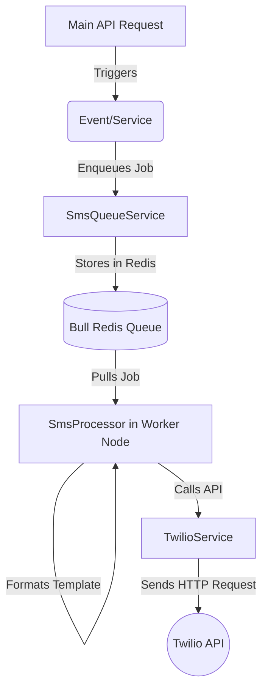

# SMS Notifications Architecture & Implementation Guide

This document outlines the architecture and technical flow of the asynchronous SMS notification system in AiVestire using Twilio, Bull (Redis), and NestJS.

## 🏗️ High-Level Architecture

The SMS system is fully decoupled from the main API thread. We use a **Producer-Consumer** pattern to ensure that sending SMS messages (which involves slow, potentially unreliable external API calls to Twilio) never blocks user requests (e.g., placing an order or uploading a product).

### Components Breakdown

1. **`TwilioService` (`src/common/twilio.service.ts`)**
   - **Role:** The Low-Level API Wrapper.
   - **Responsibility:** Holds Twilio credentials, establishes the connection to the Twilio SDK, and executes the raw HTTP request to Twilio's servers. 
   - **Awareness:** It knows *nothing* about queues, retry policies, or message formatting.

2. **`SmsQueueService` (`src/queues/sms-queue.service.ts`)**
   - **Role:** The Producer.
   - **Responsibility:** Pushes SMS payloads into the `sms-notifications` Redis queue. It specifies the configuration for the job (e.g., 3 retries, exponential backoff).

3. **`SmsProcessor` (`src/worker/sms.processor.ts`)**
   - **Role:** The Consumer (Background Worker).
   - **Responsibility:** Listens for jobs in the background. It takes raw data from the queue, formats it into rich, readable text using templates, and calls `TwilioService` to dispatch the message. It handles the retry/failure logic based on Twilio's response.

4. **Templates (`src/common/sms-templates/*.ts`)**
   - **Role:** Formatting logic.
   - **Responsibility:** Keeps the processor clean by isolating the text formatting logic (e.g., building Myntra/Flipkart style receipts).

## 🔄 Core Workflows

### 1. Order Confirmation Flow
- User places an order via `OrderService`.
- `OrderService` completes the DB transaction and emits an `order.booked` event.
- `OrderEventListener` catches the event, fetches the buyer's phone number, and calls `SmsQueueService.enqueueOrderConfirmationSms()`.
- The job goes to the background queue. The API responds to the user instantly.
- `SmsProcessor` wakes up, builds the `Order Confirmed` template, and sends the SMS.

### 2. Creator Cloth Upload Flow
- Creator uploads a new cloth hierarchy via `CreatorUploadService`.
- After images are uploaded and the DB transaction succeeds, the service calls `SmsQueueService.enqueueCreatorUploadSms()`.
- The job is queued. The API responds with success immediately.
- `SmsProcessor` wakes up, builds the `Upload Successful` template, and sends the SMS.

## 🛡️ Resilience & Failure Handling

External APIs like Twilio can fail for various reasons (rate limits, bad phone numbers, network timeouts). Our architecture guarantees robust failure handling:

### 1. The Main Thread is Protected
Because the actual sending happens on the **Worker Node**, a Twilio outage or slow response will *never* cause an API request to hang or fail. If the SMS fails, the order is still successfully placed.

### 2. Smart Retries (Exponential Backoff)
If a transient error occurs (e.g., Twilio responds with a `500 Server Error` or `429 Too Many Requests`), the Bull queue automatically retries the job 3 times with an exponential backoff:
- **Attempt 1 Fails** ➔ Waits 5 seconds
- **Attempt 2 Fails** ➔ Waits 10 seconds
- **Attempt 3 Fails** ➔ Waits 20 seconds ➔ Marks job as permanently failed.

### 3. Fast-Fail for Non-Retriable Errors
Not all errors should be retried. If the destination phone number is invalid (e.g., `21211 Invalid 'To' phone number`), retrying won't magically fix it. 
- We maintain a list of `NON_RETRIABLE_TWILIO_CODES` in `src/worker/constants/sms.constants.ts`. 
- If `TwilioService` throws one of these errors, `SmsProcessor` immediately discards the job without wasting queue resources or Twilio API limits.

### 4. Development & Testing Bypasses
- If `SKIP_SMS_IN_DEV=true` or `SKIP_TWILIO=true` is set in the `.env` file, the system will log the SMS payload to the console instead of sending it. 
- If Twilio credentials are not provided in the `.env`, the processor safely downgrades to "no-op" mode, preventing application crashes.

## 🧩 Adding New SMS Notifications in the Future

To add a new type of SMS notification:
1. Define a new payload interface and template function in `src/common/sms-templates/`.
2. Add a new `JOB_NAME` in `src/common/constants/queue.constants.ts`.
3. Add a new enqueue method in `SmsQueueService` (`sms-queue.service.ts`).
4. Add a new `@Process(JOB_NAMES.YOUR_NEW_JOB)` handler in `SmsProcessor` (`sms.processor.ts`).
5. Call the `SmsQueueService` from your feature module/service!
